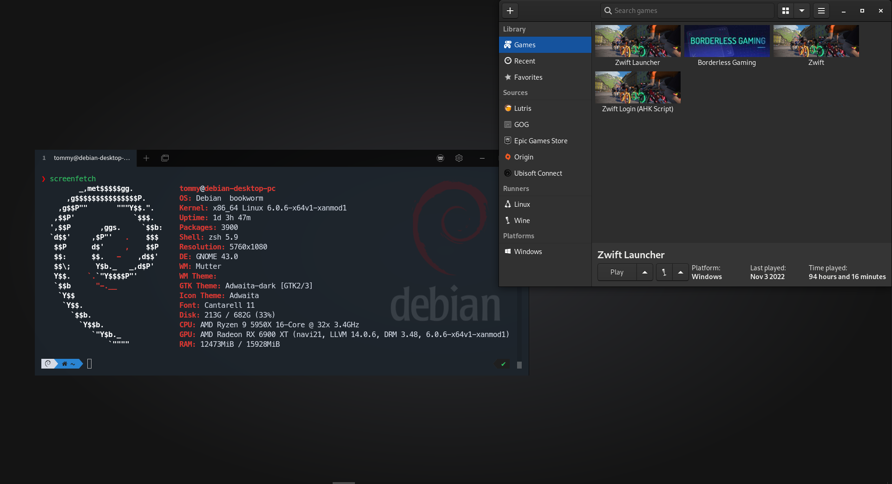
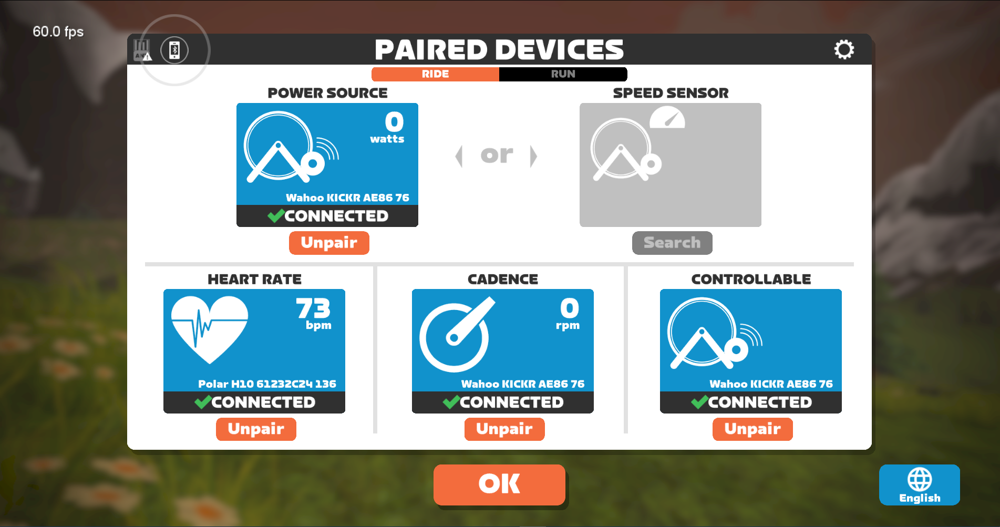

---

title: "How To: Zwift on Debian Linux"
post_status: publish
post_excerpt: Here’s a guide on how to make Zwift run on Debian 11, together with all the settings.
comment_status: open
taxonomy:
    category:
        - linux
        - debian
        - gaming
    post_tag:
        - linux
        - gaming
        - zwift
        - wine
        - lutris
        - borderless

---

# How to Zwift on Debian 11

###  Here’s a guide on how to make Zwift run on Debian 11, together with all the settings.



Using:

Wine 7.18 (Staging) 
```
sudo dpkg --add-architecture i386 
```

Add [winehq repo](https://wiki.winehq.org/Debian) and run:
```
sudo apt install wine-staging-amd64 wine-staging-i386 wine-staging winehq-staging
```

or 

```
sudo apt install --install-recommends winehq-staging
```

[Add Lutris repo](https://github.com/lutris/docs/blob/master/InstallingDrivers.md) and install latest: Lutris 0.5.11

Install Zwift and Wine dependencies using Lutris script, but do not launch Zwift: https://lutris.net/games/zwift/

**Note**: *If you're having issues installing, you could install Zwift on a windows PC and copy all the files into the wineprefix.* (I did)

Settings:

 - Runner options: Use system [wintricks (20220411-next)](https://github.com/Winetricks/winetricks)


 - Download the latest winetricks script (master="latest version") from Github:
```
wget https://raw.githubusercontent.com/Winetricks/winetricks/master/src/winetricks
```
 - Mark the winetricks script (we've just downloaded) as executable. See:
https://www.tldp.org/LDP/GNU-Linux-Tools-Summary/html/x9543.htm
```
chmod +x winetricks
```
 - Move the winetricks script to a location which will be in the standard user PATH. See:
https://www.tldp.org/LDP/abs/html/internalvariables.html
```
sudo mv winetricks /usr/bin
```
 - Runner options: Turn on Windowed (virtual desktop) and set resolution.
   - This will allow ALT + TAB to other windows while in game without it minimizing when used with Borderless gaming.  
   - System options: Disable Lutris Runtime

 - Run: 
```
WINEPREFIX=/home/tommy/Games/zwift winetricks -q -v d3dcompiler_47 dotnet20 dotnet40 dotnet48
```
Includes d3dcompiler_47 ([workaround crash issue](https://github.com/netbrain/zwift/blob/af1f20c37557033f85c6e54d10918a3eb12df55d/entrypoint.sh#L50))
* Download WebView2 Evergreen Standalone installer: https://developer.microsoft.com/en-us/microsoft-edge/webview2/
* In Lutris, *Run EXE inside Wine prefix* and install the downloaded MicrosoftEdgeWebView2RuntimeInstallerX64.exe

Next up: 
- Duplicate the Zwift game in Lutris and edit it
- Change the name to Zwift Launcher
- Edit the Executable to the path of ZwiftLauncher.exe (~/Games/zwift/drive_c/Program Files (x86)/Zwift/ZwiftLauncher.exe)
- Remove the arguments
- Save

[Credits to this Reddit post](https://www.reddit.com/r/Lutris/comments/v8gdib/zwift_on_linux_using_lutris/)

**Added bonus**: Borderless Gaming

* Download [BorderlessGaming9.5.6_admin_setup.exe](https://github.com/Codeusa/Borderless-Gaming/releases/download/9.5.6/BorderlessGaming9.5.6_admin_setup.exe) to wineprefix

* In Lutris, *Run EXE inside Wine prefix* and install the downloaded BorderlessGaming9.5.6_admin_setup.exe

* In Lutris, click on the + sign in top left corner and fill in:
  * Name: Borderless Gaming
  * Runner: Wine
  * Game options: 
  * Executable: `~/Games/zwift/drive_c/Program Files (x86)/Borderless Gaming/BorderlessGaming.exe` 
  * Working Directory: `~/Games/zwift/drive_c/Program Files (x86)/Borderless Gaming`
  * Wine prefix: `~/Games/zwift`

Download [this image](https://camo.githubusercontent.com/516cad17dcf42ab9344f5bcb87cc9b99f8fe9f164ee6193fab06627a14786cef/687474703a2f2f63646e2e616b616d61692e737465616d7374617469632e636f6d2f737465616d2f617070732f3338383038302f6865616465722e6a70673f743d31343437333737313439) and add it in the Game info tab.


**Running Zwift**

1. Open Lutris

2. Open Zwift Launcher

3. Open Zwift

4. Open Bordeless Gaming and add Zwift to favorites

5. Open Zwift Companion app for Bluetooth 
  - **(Only needed for heart rate monitor if you are running a Kickr V5 or V6 with Direct Connect)**



6. Ride on

Tested (Oct 9, 2022) with a [100 km + ride](https://www.zwift.com/activity/1185451456287768576) without fault, and runs way better with less load than on Windows 10.

Enjoy! 😎
